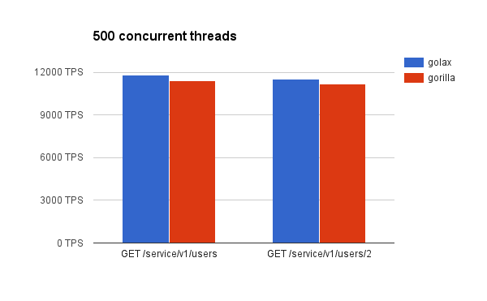

# golax performance

<!-- MarkdownTOC autolink=true bracket=round depth=4 -->

- [Intro](#intro)
- [The results](#the-results)
- [Run tests in your machine](#run-tests-in-your-machine)
- [About the implementations](#about-the-implementations)
    - [Golax](#golax)
    - [Gorilla](#gorilla)
- [About the code readability and maintainability](#about-the-code-readability-and-maintainability)

<!-- /MarkdownTOC -->

## Intro

The reason for this project is [this question](https://groups.google.com/forum/#!msg/golang-nuts/W8oETGFBu_o/Z4glNpoiGgAJ) made by [Adrian Sampaleanu](https://plus.google.com/+AdrianSampaleanu) in _golang-nuts_.

The performance compared with the [most popular alternative](http://www.gorillatoolkit.org/) is very similar (actually _golax_ performs slightly better) however code readability and maintainability is far better with _golax_ implementation.

## The results

<p align="center">
    
</p>

<p align="center">
    
</p>

Tests has been executed in a `Intel(R) Core(TM) i5-3210M CPU @ 2.50GHz`.

## Run tests in your machine

Make and run golax:

```sh
make golax
```

Make and run gorilla:
```sh
make gorilla
```

Execute tests:

10 threads:
```sh
ab -n 100000 -c 10 http://localhost:8000/service/v1/users
ab -n 100000 -c 10 http://localhost:8000/service/v1/users/2
```

500 threads:
```sh
ab -n 100000 -c 500 http://localhost:8000/service/v1/users
ab -n 100000 -c 500 http://localhost:8000/service/v1/users/2
```

## About the implementations

### Golax

The implementation is the standard way a REST API should be implemented with golax.

### Gorilla

Gorilla implementation has been done following [Making a RESTful JSON API in Go](https://thenewstack.io/make-a-restful-json-api-go/) article.

## About the code readability and maintainability

TODO: comment several points here, and how easy (or not) is adding middlewares/interceptors and routes.
